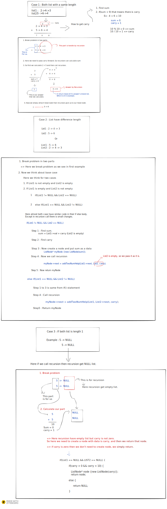

### Add two numbers
You are given two non-empty linked lists representing two non-negative integers. The digits are stored in reverse order and each of their nodes contain a single digit. Add the two numbers and return it as a linked list. 
You may assume the two numbers do not contain any leading zero, except the number 0 itself.

### Example :
Input: (2 -> 4 -> 3) + (5 -> 6 -> 4) 
Output: 7 -> 0 -> 8 
### Explanation: 
342 + 465 = 807.

### My solution

#### Recursive approach

